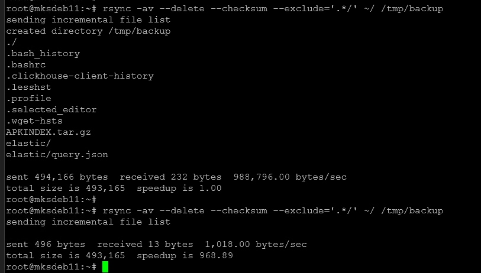
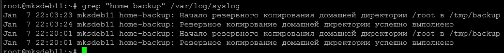
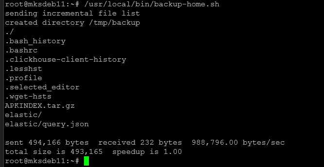

# Домашнее задание к занятию "`Резервное копирование`" - `Милованов Константин`
[Домашнее задание](https://github.com/netology-code/sflt-homeworks/blob/main/3.md)

### Задание 1

1. Составьте команду rsync, которая позволяет создавать зеркальную копию домашней директории пользователя в директорию /tmp/backup
2. Необходимо исключить из синхронизации все директории, начинающиеся с точки (скрытые)
3. Необходимо сделать так, чтобы rsync подсчитывал хэш-суммы для всех файлов, даже если их время модификации и размер идентичны в источнике и приемнике.
4. На проверку направить скриншот с командой и результатом ее выполнения

### Решение
Команда:
`rsync -av --delete --checksum --exclude='.*/' ~/ /tmp/backup`

Скриншот:

---

### Задание 2

1. Написать скрипт и настроить задачу на регулярное резервное копирование домашней директории пользователя с помощью rsync и cron.
2. Резервная копия должна быть полностью зеркальной
3. Резервная копия должна создаваться раз в день, в системном логе должна появляться запись об успешном или неуспешном выполнении операции
4. Резервная копия размещается локально, в директории /tmp/backup
5. На проверку направить файл crontab и скриншот с результатом работы утилиты.

### Решение

Файл crontab:

`20 22 * * * /usr/local/bin/backup-home.sh`

Скриншот с записями из лога. В 22:03 тестовый запуск вручную. Затем в 22:20 запуск по расписанию из crontab:

Дополнение:

Скриншот выполнения скрипта:

Скрипт:
[Скрипт](./files/backup-home.sh)
