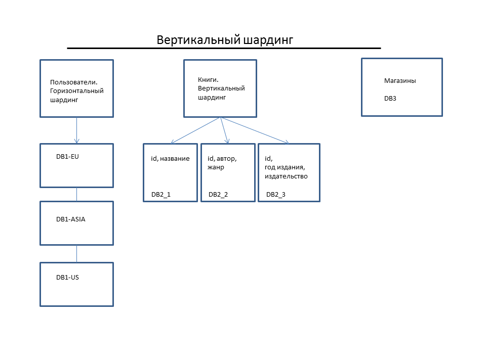

# Домашнее задание к занятию "`Репликация и масштабирование. Часть 2`" - `Милованов Константин`
[Домашнее задание, ссылка](https://github.com/netology-code/sdb-homeworks/blob/main/12-07.md)

### Задание 1

Опишите основные преимущества использования масштабирования методами:

1. активный master-сервер и пассивный репликационный slave-сервер;
2. master-сервер и несколько slave-серверов;

Дайте ответ в свободной форме.

### Решение

1. Один пассивный slave. Это не столько масштабирование, сколько основа для отказоустойчивости, который дает следующие преимущества:

- Масштабирование надежности: Основная цель — убрать единую точку отказа.
- Масштабирование обслуживания: Появилась возможность обслуживать БД без даунтайма. Мы переключаем нагрузку на Slave, чиним Master, переключаем обратно.

2. Несколько slave-серверов. Здесь мы подключаем slave-серверы к работе. Master берет на себя запись, Slave-ы — чтение. Основные преимущества:
- Горизонтальное масштабирование вычислительной мощности. Запросы SELECT идут на слейвы, они забирают на себя эту нагрузку, при этом разделяя ее между собой.
- Мы можем разместить разные наборы данных в БД и кэше разных slave-серверов. И оптимизировать каждый в засисимости от этого.
- Географическое масштабирование. Мы можем разместить Slave-сервера ближе к пользователям.
- Разделение по бизнес-процессам: аналитики могут строить тяжелые запросы на отдельном слейве, не мешая продакшену.

---

### Задание 2

Разработайте план для выполнения горизонтального и вертикального шардинга базы данных. База данных состоит из трёх таблиц:

- пользователи,
- книги,
- магазины (столбцы произвольно).

Опишите принципы построения системы и их разграничение или разбивку между базами данных.

Пришлите блоксхему, где и что будет располагаться. Опишите, в каких режимах будут работать сервера.

### Решение

Модель данных:

пользователи: id, имя, email, регион.

книги: id, название, автор, жанр, год издания, издательство.

магазины: id, название, регион, город, адрес, телефон, директор (и другие поля).

#### План шардинга.

1. Вертикальный шардинг — разнесем таблицы на разные серверы, а также разделим одну таблицу внутри.
- Сервер DB1. Только таблица пользователи.
- Сервер DB2. Только таблица книги. Предположим что книг - миллионы. Тогда, чтобы поиск книг и работа с каждой таблицей шли быстрее, можно выделить в отдельные таблицы такие поля как: shard_1 (id, название), shard_2 (id, автор, жанр), shard_3 (id, год издания, издательство). Название вынесли, так как название книг бывает длинным и занимаем много места. Можно будет вынести каждую шард-таблицу на отдельный сервер при необходимости.
- Сервер DB3. Только таблица магазины. У таблицы много полей, поэтому таблицу можно было бы шардировать саму таблицу вертикально, разделив колонки. Но предположим, что магазинов не более 10 000 шт, поэтому оставим как есть, просто вынеся ее на отдельный сервер.

2. Горизонтальный шардинг — применим к таблице пользователи. Пользователей много (миллионы), разделим по регионам. Каждый шард — отдельный сервер:
- Шард 1: пользователи из Европы - DB1-EU
- Шард 2: пользователи из Азии - DB1-ASIA
- Шард 3: пользователи из США - DB1-US

Для надежности каждый сервер также необходимо будет поднять в 2-х экземплярах - Master + Slave.
